# 3. Context and scope

State: **As-built**

[Explore HTML](diagrams/system-context.html) · [JSON source](diagrams/system-context.json)

Only the host source tools access Linear or GitHub. File operations and report
exploration are local; source facts retain their source ownership. The diagram
summarizes [SKILL.md](../../SKILL.md), the [capture contract](../../references/capture.md),
[CLI](../../bin/stellar.ts) and [renderer](../../lib/render.ts).

| Participant     | Responsibility and boundary                                                |
| --------------- | -------------------------------------------------------------------------- |
| User            | Defines scope and preferences, reviews grouping, owns corrections          |
| Host agent      | Uses available source access, interprets work, authors work-map data       |
| Source system   | Owns issue facts, original identifiers, statuses, and registered relations |
| Stellar tooling | Validates input and creates an interactive artifact                        |
| Local browser   | Displays the bundled viewer and supports exploration/export                |

State: **As-built**

[The local skill](../../SKILL.md) guides source collection, normalization,
classification, validation and rendering. [Native normalizers](../../lib/normalize.ts)
accept Linear connector and GitHub REST captures, including mixed-source reports.
Authentication, pagination and actual API availability belong to the host's
existing tools. Stellar has no standalone OAuth service or network client.
The [validation record](../validation/2026-09-12-source-aware-skill.md) distinguishes
local fixture coverage, explicit skill use, live source sampling, and publication.

The initial scope is read-oriented collection, classification, generation, and
exploration. Source writeback, continuous background synchronization, hosted
accounts, collaborative editing, and a backend database are outside the accepted
first implementation.

Out-of-scope issues may be included as relationship context, but they must not
be added to the assigned-issue totals. A partial context lookup must not be
presented as an exhaustive source-system relationship inventory.
