# 5. Building-block view

State: **As-built**

| Building block      | Owns                                                                                                         | Evidence                                                                                                                        |
| ------------------- | ------------------------------------------------------------------------------------------------------------ | ------------------------------------------------------------------------------------------------------------------------------- |
| CLI                 | Version/help dispatch, argument handling and deferred workflow execution                                     | [bin/stellar.js](../../bin/stellar.js), [command catalog](../../lib/cli-help.js), [runtime dispatch](../../lib/cli-commands.js) |
| Installation doctor | Read-only Node and installed-build consistency diagnostics                                                   | [installation.js](../../lib/installation.js), [CLI checks](../../test/cli-diagnostics.test.js)                                  |
| Work-map schema     | Report, issue, classification, relation and reference shape                                                  | [schemas](../../schemas/README.md)                                                                                              |
| Validator           | Unique identities, references, primary classification, source-parent and URL invariants                      | [validate.js](../../lib/validate.js)                                                                                            |
| Renderer            | Locale selection, owner-derived branding, safe HTML embedding and preservation of previous output on failure | [render.js](../../lib/render.js)                                                                                                |
| Run verifier        | Native-capture facts, embedded data, exact bundled output and optional state-map consistency                 | [verify.js](../../lib/verify.js), [tests](../../test/verify.test.js)                                                            |
| Evidence transfer   | Fresh private file copy and digest without payload re-emission; not source authentication                    | [evidence.js](../../lib/evidence.js)                                                                                            |
| Evidence reader     | Structural indexes, literal search and exact source excerpts; no semantic ranking                            | [reading.js](../../lib/reading.js), [tests](../../test/reading.test.js)                                                         |
| Viewer              | Styling, SVG components, layout, navigation, inspector and export                                            | [assets/viewer](../../assets/viewer/README.md)                                                                                  |
| Locale catalogs     | Bundled Korean and English fixed UI text and naming patterns                                                 | [Korean](../../assets/viewer/locales/ko.json), [English](../../assets/viewer/locales/en.json)                                   |
| Examples and tests  | Public reuse and behavior evidence using invented data                                                       | [examples](../../examples/README.md), [core tests](../../test/core.test.js), [browser tests](../../test/browser/viewer.test.js) |
| Development tooling | Locked native dependencies, Just gates, hooks and CI caller                                                  | [development](../development/README.md)                                                                                         |

The installed runner is generated from the same CLI and library source by
[build-runner.js](../../scripts/build-runner.js), with dependencies included in
[stellar.mjs](../../bin/stellar.mjs) and full third-party notices retained.
The build embeds only the product version from the root [package.json](../../package.json) and
generates [stellar.manifest.json](../../bin/stellar.manifest.json) from the runner
and fixed schema/viewer inventory. Before generation or comparison, the build
checks that the fixed list covers the schema/viewer directory conventions,
including locales; contributor metadata and optional assets are excluded. The
doctor retains its fixed allowlist and compares file hashes with this local
manifest; it does not authenticate a release. CLI version and help
requests finish before runtime modules read schemas, so broken resources do not
prevent diagnosis. Global and per-command `-h` are aliases of `--help`.
Mixed help/positional arguments are rejected before workflow
loading, while `search-issue` retains literal search text. The
[diagnostic helper](../../lib/cli-diagnostics.js) prints executable invocation
pointers and safe runtime error categories/code locations without resource
excerpts. [CLI guidance](../../references/cli.md) owns the interface and explains
how to investigate a runtime failure when local manifest checks pass.
Schemas and viewer assets keep their authoritative paths beside it. Installed
usage needs Node 24; contributor tooling is separate. See
[distribution](../development/distribution.md).

The single native root is the repository's Node package. The viewer is bundled
source, not an independently deployed service. No L1 boundary or multi-package
workspace is necessary for these directories.

## Planned source typing

State: **Target**

The [TypeScript scope](../development/typescript-adoption.md#baseline-and-first-scope)
includes the source CLI and all 12 current core modules together, with generated
schema declarations and strict checks. It preserves these runtime owners and the
installed JavaScript runner. Viewer and existing tooling/test source typing are
deferred; their imports and source-path consumers still require coordinated
updates. The blocks above remain As-built JavaScript until implementation.

## Agent workflow

State: **As-built**

[SKILL.md](../../SKILL.md) owns common collection, classification, repair and
handoff guidance. Source-specific references define host retrieval and capture
boundaries. [normalize.js](../../lib/normalize.js) translates native facts into
one canonical work-map draft; [classification guidance](../../references/classification.md)
keeps judgment with the agent. [continuity.js](../../lib/continuity.js) owns
first-draft choice application, saved choices, refresh matching and actor-specific updates; its state contains
a current work map plus private remembered interpretation. [link-skill.js](../../scripts/link-skill.js) safely
registers this checkout in the user's local discovery directory. It does not
publish a package or replace another installation.

## Artifact ownership and continuation

[Explore HTML](diagrams/artifact-ownership.html) · [JSON source](diagrams/artifact-ownership.json)

The main path shows first generation with assigned work to classify. `normalize`
creates a draft from a retained capture; the host agent authors choices after
reading evidence. `classify-draft`
consumes both and writes the three JSON artifacts in one fresh run directory.
`render` then consumes only the completed map. The lower branch identifies the
input to later operations: `refresh` combines saved state with a new capture;
`classify` or `revise` combines it with agent choices or explicit user corrections.
Each operation writes another fresh run, not back into the selected state.

| Artifact           | Producer and responsibility                                                                                                                                                           | How it is used next                                                                                                                                                                  |
| ------------------ | ------------------------------------------------------------------------------------------------------------------------------------------------------------------------------------- | ------------------------------------------------------------------------------------------------------------------------------------------------------------------------------------ |
| Native capture     | Host collector retains native observations, per-source scope, timestamps and declared coverage. Retained response files support inspection but a digest is not source authentication. | Input to `normalize`, `refresh` and the source-fact part of `verify-run`. It contains no authoritative purpose grouping.                                                             |
| Unclassified draft | Normalizer translates identities, current facts and registered relations. Missing assigned classifications are expected at this stage.                                                | Input to evidence reading and first-run `classify-draft`. Missing classification blocks rendering only for assigned issues; a valid empty or context-only draft can render directly. |
| Choices            | Agent authors purpose categories, rationale and targets; explicit user corrections use the same choices shape through `revise`.                                                       | Operation input, not a saved-state replacement. The command establishes actor ownership; choices cannot supply their own origin.                                                     |
| Current work map   | Runner combines current observations with the permitted interpretation. Refresh may produce a map with pending assigned classification.                                               | Renderer input only after complete validation; embedded in HTML. It excludes absent issues and private continuity memory.                                                            |
| Saved state        | Continuity runner retains the current map, remembered decisions, separate classification/target ownership, evidence and review reasons.                                               | Select the intended latest successful state for the next operation, even when its map still needs classification. Starting from an older state starts another lineage.               |
| Change summary     | Continuity runner reports changes relative to the selected prior observation and outstanding current review. The first-run summary is empty.                                          | Inspect what needs attention. It is neither an event log nor a replacement for state; `notObserved` does not mean deleted or completed.                                              |
| Standalone HTML    | Renderer embeds the validated map and fixed viewer. It does not automatically include saved state or retained source-response files.                                                  | Browser exploration and deliberate sharing. Navigation and SVG export do not save classification edits or continue a run.                                                            |

For a first run with no assigned issues and no decisions to apply, validate the
draft and render it directly. If saved state is needed for continuation, use
[`remember`](../../references/continuity.md#start-from-a-completed-map) to create
the initial run, then render its `work-map.json`. An empty choices object is
rejected, so this case does not require `classify-draft` or invented categories.

The [schemas](../../schemas/README.md) own exact fields and validation. The
[run guide](../../references/runs.md) owns filenames, retained evidence and
handoff contents; the [continuity guide](../../references/continuity.md) owns
command semantics. The [synthetic walkthrough](../../examples/continuity-walkthrough.md)
connects these artifacts through first generation, a user correction and refresh.
All data-bearing derivatives need the privacy treatment of their inputs.

## Rendering and brand assets

[Explore HTML](diagrams/viewer-rendering.html) · [JSON source](diagrams/viewer-rendering.json)

[renderWorkMap](../../lib/render.js) validates input, selects the bundled locale,
escapes embedded JSON and titles, and inserts the fixed shell, styles and viewer.
The [Open Star SVG](../../assets/viewer/stellar.svg) is the single vector source
for the inline header and data-URL favicon. The header inherits its theme accent;
the favicon uses the SVG default color. The [README banner](../brand.md#readme-banner)
is separate promotional artwork. No image-generation service or Archify runtime
is involved in rendering a user report. Identical ordered data and viewer assets
produce identical HTML bytes; input order remains meaningful.
