# 6. Runtime view

State: **As-built**

## First report

[Explore HTML](diagrams/first-report.html) · [JSON source](diagrams/first-report.json)

The [skill](../../SKILL.md) orchestrates host reads and local commands. Retain
native records and collection limits before interpretation. `inspect` and
`read-issue` expose evidence; the agent authors purpose-based choices and rationale.
`classify-draft` applies those choices and requires every assigned issue to have
a primary classification before writing the first run. It never invents a
taxonomy. Rendering, artifact verification and browser review are separate steps;
the final open action in the diagram does not prove those checks passed.
The detailed collection and reading boundaries appear below.

The [synthetic walkthrough](../../examples/continuity-walkthrough.md) executes
this path, records an explicit user correction, then refreshes changed source
text and resolves the remaining agent classification. Use the
[artifact ownership view](05-building-block-view.md#artifact-ownership-and-continuation)
to choose which file continues each step.

## Validate and generate

1. The caller supplies a work-map JSON file and an output HTML path.
2. The CLI parses JSON and validates shape, identities, references, classification,
   relation semantics and URLs. Errors identify the field and repair.
3. The renderer reads its own shell, style, script, Open Star SVG, and selected locale catalog
   relative to its module.
4. It derives the owner’s Stellar name, escapes the title and embedded JSON,
   and replaces structural and localized text slots once.
5. It writes a uniquely named temporary file beside the output and renames it
   after successful generation. Validation or write failure preserves the previous
   usable report. The input or its symlink alias cannot be the output.
6. A local browser opens the artifact. All ordinary exploration is offline.
   Links navigate when selected; SVG export downloads the current visible canvas.

[render.js](../../lib/render.js), [CLI integration tests](../../test/core.test.js)
and [browser tests](../../test/browser/viewer.test.js) own this behavior.
The renderer does not modify input files or copy referenced attachments.

## Verify supplied artifacts

[Explore HTML](diagrams/run-verification.html) · [JSON source](diagrams/run-verification.json)

Each input pair in the diagram includes the **same selected work map**. HTML
appears in both the embedded-data and rendered-byte pairs; the latter also uses
the current runner and its bundled assets. `captureFacts` re-normalizes the capture and
compares current source facts; `embeddedMap` requires exactly one equal embedded
JSON map; `bundledViewer` compares the original HTML bytes to a fresh in-memory
render by the current runner; optional `stateMap` compares `state.map`. HTML is
read as data and never executed. A passing result is not proof of collection
completeness, classification meaning, prior-state continuity or browser behavior.

`verify-run CAPTURE MAP HTML [STATE]` normalizes the capture, validates the final
map and optional state, and compares source declarations, owner, issue facts and
registered edges. Source and issue array ordering is ignored. Related edges are
undirected; other edges retain direction. Interpretation fields and unqueried
context status labels are excluded from source-fact comparison. Full-detail
status labels are compared verbatim, including the normalizer's English
`Unknown` fallback for missing Linear status text in either locale. Locale and
view remain author-editable presentation choices even when copied from the
capture. These, taxonomy and document references are outside the capture-fact
comparison, but remain part of the complete embedded-map and rendered-output
checks.

The verifier parses exactly one bundled JSON data slot without executing HTML,
compares its data with the final map, and reproduces the current checkout's HTML
in memory (using the installed runner and colocated viewer for installed skills).
It compares the original file bytes against that output encoded as
UTF-8, matching the renderer's file-write encoding. Separate decoding for JSON
inspection cannot hide corrupted bytes from this comparison. Optional saved
state must validate and contain the same final map. A different renderer revision
may produce a mismatch; verification does not rewrite old artifacts to resolve it.

The command reads files and prints JSON only. Mismatches report input roles and
JSON pointers. Unknown embedded keys are reported at their containing object or
array without echoing those keys; input-read failures omit raw filesystem paths.
It performs no source calls, browser actions or artifact writes. Source collection,
semantic classification, visual interaction and preservation relative to an
earlier state remain explicitly unverified by this command. See
[verify.js](../../lib/verify.js), [tests](../../test/verify.test.js), and
[run evidence](../../references/runs.md).

## Browser exploration

Status filters count assigned issues only. Domain/category selection expands
purpose-based work. Search includes assigned and context issues. Issue selection
shows its direct registered neighbors and classification path. Assigned work
outside the current status filter is labeled separately from source-declared
context; neither enters the current count. Context-only target tags are descriptive
and cannot activate a filter with no assigned target membership.
Collapsed edges retain actual source issue pairs for inspection. Target overlays
combine existing classifications without inventing relations. Navigation history
is in memory; repeated selection of the same node does not add another entry.
Local storage retains only the theme preference. Hidden search results cannot
be selected with Enter, and viewer shortcuts leave browser modifier keys alone.

## Source collection

State: **As-built**

The host first establishes a mechanical response-retention path as described in
[run evidence](../../references/runs.md). `retain-response` copies a provided
file to a fresh private destination, returning its byte count and SHA-256. It
does not replace a destination, echo the payload or certify where the input came
from. Output diagnostics distinguish occupied destinations, invalid parent paths
and denied permissions, without exposing raw filesystem paths.
A host that only exposes model-visible text must disclose that limitation
instead of retyping long responses or repeatedly recollecting them.

The host follows [the skill](../../SKILL.md), exhausts the requested source query
or records partial coverage, retrieves descriptions and supported relations, and
writes native [capture JSON](../../references/capture.md). The normalizer consumes
issue text/status from top-level records, not from relationship objects.
The host [reuses already-obtained complete endpoint detail as a deduplicated
context record](../../references/capture.md#carry-obtained-endpoint-detail-into-records)
before normalization; incomplete references remain unqueried context. No source
request is needed solely for that transfer. The normalizer
first validates shared metadata and source declarations with the canonical
validator, before indexing sources or interpreting native records. It then
indexes source-qualified native/identifier pairs from all detail and
relationship observations. It rejects conflicting explicit native IDs, then
resolves aliases before emitting full issues, unknown context and deduplicated
relations in their original direction. An unfetched context referenced by UUID
and display identifier has one identity regardless of observation order.
Missing classifications are expected in the draft; other semantic failures stop
before output is written. Normalization diagnostics point back to captured fields
and relationship observations, including the native field supplying selected
context metadata and a parent observation within a cycle.
Missing, malformed or non-HTTP GitHub URLs fail at `html_url` before repository
resolution; malformed assignee/label arrays and elements identify the corresponding capture
field with repair guidance instead of throwing an unstructured JavaScript error.
The agent authors taxonomy/classification/target choices and applies them with
`classify-draft`, then invokes validation and rendering. Normalization shares the renderer's atomic
writer and input-alias protection. Source-specific freshness and coverage remain
visible in the header/help; no source access occurs when opening the artifact.

## Progressive evidence reading

State: **As-built**

After normalization, `inspect` pages through issue metadata or structural body
blocks without requiring completed classifications. `read-issue` returns exact
source substrings; `search-issue` locates case-sensitive literal text across the
whole body, including block boundaries, and maps match starts to block offsets.
Reader and response-retention errors use the canonical diagnostic `fix` field.
Both body-index and search previews explicitly report truncation.
All blocks remain accessible in source order, including unheaded prose, lists and code.
Pages/chunks bound output size but are not a semantic relevance filter or token
budget. No heading names, language or issue templates are mandatory.

The agent expands reading when evidence is insufficient, including to complete
text when needed. Source descriptions and continuity evidence stay complete even
when only excerpts are model-visible. Description hashes identify changed readable
text, treating missing/null descriptions as empty text for that digest only.
`descriptionPresent` distinguishes an omitted field from an observed string or
null. Block/character offsets belong to the text and must be refreshed after changes.
See [reading.js](../../lib/reading.js) and [the reader guide](../../references/reading.md).
This local reader does not intercept host tool responses: input already delivered
in full to a model is not retroactively reduced. Host capabilities determine the
initial data-transfer path; no measured latency or token reduction is asserted.

## Saved classification and refresh

[Explore HTML](diagrams/refresh-continuity.html) · [JSON source](diagrams/refresh-continuity.json)

[refreshState](../../lib/continuity.js) first normalizes current facts, checks the
owner and matches provider, namespace and native identity. Explicit user
classifications survive text changes. Eligible agent classifications can carry
forward; new assigned issues, changed full text for an agent classification and
saved pending review require reconsideration. For matched identities, remembered
target tags are always carried forward during refresh, including while an agent
classification is withheld. Classification and target ownership are tracked
separately; target-only edits do not clear classification review. Absent decisions remain in private
memory but absent issues do not enter the current map. A fresh refresh run can be
saved while assigned issues still need classification: saved does not mean
renderable. The [continuity contract](../../references/continuity.md) owns the
exact command inputs and review reasons.

State: **As-built**

`classify-draft` accepts a normalized first draft and agent-authored choices.
It permits missing assigned classifications only while preparing the input,
uses the shared choices validation and authority rules, and requires a complete
map before writing matching state. Context may remain unclassified. The initial
change summary is empty because no earlier observation is compared. Facts and
registered relations are preserved; no semantic classification is generated.
Invalid choices or incomplete assignments fail before run creation. Missing
classification diagnostics identify the draft map issue and explain how to add
its canonical ID, category and rationale to choices without supplying origin. Use
`classify` with existing state to preserve absent decisions and ownership.

`remember` initializes a saved state from an already-valid standalone map. `refresh` accepts that
state and a native capture, normalizes current facts, and matches remembered
choices by provider/namespace/native identity. It retains missing choices in
state without restoring old issues or relations to the current report. Changed
full text withholds an agent classification until reconsidered; user decisions
are reapplied. `classify` protects user-owned fields; `revise` applies explicit
user corrections. Both update state and map together.
After input validation, choice application builds issue-ID and canonical
source-identity indexes once over its cloned state. Each choice updates the
existing objects through those indexes; issue/memory array order, canonical
identity encoding and actor checks remain unchanged. Parent-cycle validation
tracks a discovered cycle directly instead of repeatedly searching unrelated
earlier diagnostics. It still reports the first cycle in traversal order and
continues later validation. These are internal processing changes; saved-file
contracts are unchanged.
Null and omitted descriptions are equivalent purpose evidence, while current
source fields retain their original representation. Syntax errors identify the
input role; continuity-schema errors point to the offending field and explain
choices alternatives without presenting every branch as required.

Pending review reasons live with saved source identities, including while an
issue is absent or appears only as context. Current review summaries are derived
from those saved reasons. Only an explicit classification clears a reason;
target-only changes do not. Context may remain unclassified and renderable while
its lookup/review limit is disclosed.
When an unqueried issue retains a classification with remembered full-text
evidence, refresh adds a previous-observation notice for the inspector. Current
source status/detail remain unknown. Explicit reconsideration clears the notice
for that run; a full-detail refresh omits it. Each later refresh recomputes it,
so retained classification on unqueried detail with remembered full-text evidence
gets the notice again, including after reclassification while unqueried. The
recorded rationale remains intact. Target-only changes and an agent's unchanged
echo of a user choice do not clear the notice.

All run-producing commands validate their result before creating a new run directory with
owner-only access. Existing paths are refused. On write failure, cleanup targets
only files created by that operation. Each run contains `state.json`,
`work-map.json`, and `changes.json`; the renderer consumes only the work map.
Continuity rejects report-relative document references at the input field before
writing because reference files are not bundled into the new directory. HTTP(S)
references are retained through refresh. The standalone renderer still supports
relative references when the caller supplies their colocated files.
Output failures identify `/run` with repair guidance. Best-effort cleanup cannot
replace the original failure, and possible leftovers are disclosed. Continuity
run-output diagnostics omit raw filesystem error paths; JSON syntax diagnostics
omit source excerpts. Input read failures still use system error messages and
may include the supplied path, for example when an input file does not exist.
[continuity.js](../../lib/continuity.js), [first-run tests](../../test/classify-draft.test.js),
[continuity tests](../../test/continuity.test.js)
and [the skill workflow](../../references/continuity.md) own this behavior. No
background worker, continuous sync, or persistent service exists.

## Run output and failure boundary

[Explore HTML](diagrams/run-output.html) · [JSON source](diagrams/run-output.json)

[writeRun](../../lib/continuity.js) validates state before reserving a fresh
private directory. It creates `state.json`, `work-map.json` and `changes.json`
exclusively and closes each file before continuing. An existing path is refused.
A write or close failure triggers best-effort removal of only files and the
directory created by that invocation; cleanup failures disclose possible partial
output. Earlier runs remain untouched. The caller chooses a fresh path for any
retry. This is not a crash-safe multi-file transaction or automatic recovery
protocol. The separate [renderer](../../lib/render.js) writes HTML through a
private temporary file and rename, preserving an existing report on failure.

## Failure response

The host discloses the affected scope before handing off a report. A saved run,
a renderable map and a verified report are different outcomes; the following
responses preserve that distinction.

| Observed condition                                               | Effect and whether work can continue                                                                                                                        | Safe next action and preserved artifacts                                                                                                                                                                                                                                                                             |
| ---------------------------------------------------------------- | ----------------------------------------------------------------------------------------------------------------------------------------------------------- | -------------------------------------------------------------------------------------------------------------------------------------------------------------------------------------------------------------------------------------------------------------------------------------------------------------------- |
| Source lookup is partial or unavailable                          | A structurally valid map may still render, but it cannot claim complete collection or absence of dependencies. Coverage applies per source and lookup type. | Retain available capture/evidence, declare the exact coverage and missing capability, and disclose it in the handoff. Continue within the available scope; retry collection when useful. See [source collection](#source-collection).                                                                                |
| First draft lacks assigned classifications                       | `normalize` can save the draft; `classify-draft` requires all assigned issues classified before creating a run.                                             | Read the draft's evidence and complete agent choices. Preserve the capture and draft; context may remain unclassified. See [first report](#first-report).                                                                                                                                                            |
| Refresh has pending assigned classification                      | The new state/map/changes can be saved, but validation/rendering fails until assigned review is resolved. Pending context alone need not block rendering.   | Continue from that new state with `classify` after reading evidence, or `revise` for an explicit user decision. Preserve user-owned fields and matched targets. A target-only edit does not clear classification review. See [refresh](#saved-classification-and-refresh).                                           |
| Identity correspondence is uncertain                             | A display identifier cannot prove that a new native identity is the old issue. The current entry needs review; the old memory remains not observed.         | Retain both observations and disclose the correspondence uncertainty. Classify the current entry from evidence; do not rewrite identities or silently copy old choices. Classification clears its review reason, not the historical identity distinction. See [identity continuity](../../references/continuity.md). |
| Invalid input, conflicting identities or unsafe references       | Structural validation stops the affected command; coverage warnings cannot excuse invalid data.                                                             | Repair the diagnostic's input role and field using source evidence. Preserve original files. For relative references, keep the colocated standalone report or supply verified web references; do not upload or remove files merely to bypass the check. See [contract guide](../../schemas/README.md).               |
| Run destination exists, permissions fail, or a write/close fails | A fresh run is refused or incomplete; cleanup is best effort. A failed HTML replacement preserves the previous report.                                      | Keep the last successful state/report. Inspect disclosed leftovers without treating them as a completed run, correct the destination/permissions, and retry at a fresh run path. Never delete earlier runs to make room. See [output boundary](#run-output-and-failure-boundary).                                    |
| `bundledViewer` mismatches for an older report                   | Exact bytes may differ because the current runner is different; this result alone cannot distinguish renderer drift from edited HTML.                       | Keep the original capture/map/HTML/state and recover the recorded renderer in an isolated location for verification. If unavailable, disclose the unverified check. Newly rendering HTML does not verify the old artifact. See [run evidence](../../references/runs.md).                                             |
| The host cannot mechanically retain a tool response              | The local reader cannot undo a full response already sent to the model or establish provenance for a reconstructed copy.                                    | Preserve available host references and disclose the retention limit. Do not retype a large response or recollect it repeatedly just to claim file-backed evidence or token savings. See [progressive reading](#progressive-evidence-reading).                                                                        |
