# 7. Deployment view

State: **As-built**

Source is hosted in the public [weirdry/stellar repository](https://github.com/weirdry/stellar).
`dev` is the integration branch; `main` is the default branch and validated
baseline. The repository enables rebase merge and disables merge-commit and
squash integration.

The [workflow](../../.github/workflows/ci.yml) runs the repository-owned gate on
pushes to `dev` and `main`, and PRs targeting `dev`. Actual results are available
in [GitHub Actions](https://github.com/weirdry/stellar/actions/workflows/ci.yml);
workflow configuration is not proof of a successful run or merge enforcement.
The skill is distributed from GitHub; there is no npm package, deployed service,
or server-side data store.
Local private state files support requested refreshes; each operation creates a
new run and leaves earlier states and reports intact.
See [development](../development/README.md).

## Local skill use

State: **As-built**

After locked checkout setup, `just skill-link` creates a user-level `stellar`
skill symlink to this checkout. Existing different installations are not replaced.
The checkout and Node runtime must remain available; regenerate the installed
runner after source changes with `just build-runner`. The
skill resolves bundled resources relative to its root; it can render artifacts
outside the checkout. Discovery/caching belongs to the host. Local invocation
and fixture/live evidence are recorded in [validation](../validation/2026-09-12-source-aware-skill.md).

The agent selects the output base from the current user request, then an output
location already established in the conversation. Otherwise it uses
`~/Documents/Stellar/` in the execution user's home, independent of task and
installation directories. It resolves paths before invoking the CLI and uses
a fresh run directory for each generation or refresh. CLI output arguments
remain required; existing reports and states are not relocated. The
[run guide](../../references/runs.md#choose-the-run-location) owns the workflow.
The [output-location validation record](../validation/2026-09-15-output-location.md)
records the explicit synthetic invocation and its limits.

## Skill distribution

State: **As-built**

[Explore HTML](diagrams/skill-delivery.html) · [JSON source](diagrams/skill-delivery.json)

The diagram follows the tagged release path. Installation can also select
validated `main` without waiting for a tag. Bundle generation, local checks,
hosted checks, promotion, publication, installation and invocation each need
their own evidence; moving through one box does not establish later outcomes.

Stellar is MIT licensed. The public skills CLI installs the root skill from a
GitHub revision; Stellar itself is not published to npm. Instructions invoke the
committed Node.js 24 runner with bundled JavaScript dependencies. Its schemas,
viewer and guides are colocated, so generation needs no mise, Just, pnpm, Git,
or development checkout. The installer owns registration and updates.
[Distribution](../development/distribution.md) owns commands and the release
procedure; [validation](../validation/2026-09-18-skill-installation.md) distinguishes
isolated installation, command execution and host invocation evidence.

The short install command follows validated default-branch `main`. Immutable tags
identify version-pinned installations, starting with `v0.1.0`.
[GitHub Releases](https://github.com/weirdry/stellar/releases) records publication
and exact source commits. The [v0.1.0 release record](../validation/2026-09-19-v0.1.0-release.md)
records its publication and default-branch/published-tag installation acceptance.
Promotion, tag publication and installation acceptance
are separate observations. This manual GitHub release path needs no automated
publication workflow or separate npm artifact. `dev` has no deployment target.

User inputs and saved reports belong to the user. Repository refactoring or a
future artifact update must not reset or migrate those files as incidental work.
