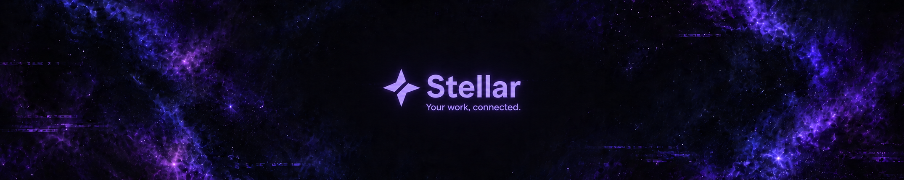

# Stellar visual identity

State: **As-built**

## Open Star

The **Open Star** mark was selected on September 19, 2026. It is a four-point
star divided into two geometric planes by an open diagonal channel. The star
connects the name Stellar to its constellation of work; the opening suggests
connections and context extending beyond any single issue.

The mark uses a strong monochrome silhouette and two filled paths. Its geometry
is the approved concept A. The other exploratory concepts are not brand assets.

## Source and integration

[stellar.svg](../assets/viewer/stellar.svg) is the single authoritative vector
source. Its `100 × 100` viewBox preserves the approved proportions and diagonal
gap. It contains no font, raster image, external dependency, or background.

The [renderer](../lib/render.js) embeds this SVG into the
[viewer shell](../assets/viewer/shell.html), replacing the temporary command-key
symbol. It also embeds the same SVG as an `image/svg+xml` data-URL favicon in
the document head. The favicon uses the SVG's default lavender and scales to
the browser's tab icon size. Each report remains one standalone HTML file with
no external logo or favicon request.
The installed skill includes the SVG with the other viewer resources.

In the viewer, the mark is decorative beside the owner-derived Stellar name
and is hidden from assistive technology to avoid announcing the brand twice.
Standalone uses should supply an accessible name, as the source SVG does.

## Core logo usage

- Keep the two planes, their relative position, and the diagonal opening intact.
  Scale uniformly; do not rotate, stretch, outline, or join the planes.
- Use one flat color for both planes. Avoid gradients, shadows, and separate
  colors for the two halves.
- Use at least **16 CSS pixels** for the square SVG viewport. The viewer uses
  **28px** in its desktop header and **23px** in its mobile header.
- Outside the viewer's established header layout, leave clear space of at least
  one quarter of the SVG viewport width on every side.
- Keep the visible name **Stellar** in prose and product titles. The lowercase
  wordmark in the concept study was a typography example; no custom wordmark
  typeface or outlined lettering has been adopted.

The geometry uses `currentColor`. The SVG's default color is Stellar lavender,
so a directly embedded image has a visible color in documentation. Inline uses
can override its CSS `color`; an external `` does not inherit the surrounding
text color. The viewer's stylesheet explicitly inherits its existing accent.

| Context                        | Color                         | Owner                        |
| ------------------------------ | ----------------------------- | ---------------------------- |
| Standalone SVG and dark viewer | Lavender `#AC9BF4`            | SVG default; dark `--accent` |
| Light viewer                   | Violet `#7564B8`              | Light `--accent`             |
| Monochrome use                 | Black on light; white on dark | Application background       |

The viewer palette is maintained in [style.css](../assets/viewer/style.css).
Choose sufficient contrast for the actual background; preserve the silhouette
and opening when exporting a monochrome variant.

## README banner

The approved [README banner](../assets/brand/stellar-readme-banner.png) is a
**2150 × 430 PNG**, with an exact **5:1** aspect ratio. The repository README
displays this file at the available width while preserving its proportions.

The banner pairs an abstract navy, blue, and violet space background with a
compact lavender Open Star, **Stellar** title, and **Your work, connected.**
subtitle. The complete logo-and-text group is centered on both axes, with ample
surrounding space. This artwork was selected on September 19, 2026.

The promotional artwork uses a restrained neon glow and glitch treatment.
These effects belong to the banner; the core SVG remains flat. Keep the approved
composition and scale the complete banner uniformly when displaying it.

## Design references

The design study considered [Grok](https://grok.com/) for directional openings,
[Linear](https://linear.app/brand) for geometric cuts and monochrome use,
[Cursor](https://cursor.com/brand) for planes and negative space, and
[Vercel](https://vercel.com/geist/brands) for a concise silhouette. These are
design observations, not affiliations or incorporated third-party assets.

The [Stellar blockchain identity](https://stellar.org/blog/foundation-news/announcing-the-new-stellar-logo)
combines a circle and diagonal strokes. Open Star uses a four-point silhouette
to establish a different visual direction.
