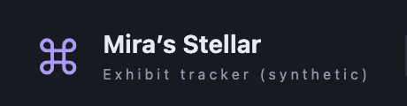

# Branding review for pull request preparation — 2026-09-19

## Source and scope

The branch `feature/open-star-and-canonical-docs` starts from development commit
`204f8b734acfd4e1c7b2c6b864ceae17c5c291bd`. This record covers the final local
branding diff before its commit: the Open Star viewer header, embedded favicon
and approved README banner. The canonical documentation and eight diagrams have
separate [generation and review](2026-09-19-canonical-documentation.md) and
[content review](2026-09-19-architecture-content.md) evidence.

The comparison uses only the invented [museum fixture](../../examples/museum.json),
with its locale set to English. The before report was rendered by the bundled
runner archived from the base commit; the after report uses the current bundled
runner. No real source capture or user report appears in these images.

| Before                                                       | After                                                     |
| ------------------------------------------------------------ | --------------------------------------------------------- |
|  |  |

These small header crops are review assets. Full generated reports, test logs,
the base archive and browser receipts remain in ignored local output.

## Actual browser checks

`just browser-check` passed **47/47** Chromium regression tests, with no failures
or skips. The compatible local Chromium headless-shell executable was supplied
through `STELLAR_CHROME`. The log is
`outputs/canonical-docs/pr-browser-check.log`.

A separate Chromium smoke opened the before and after standalone HTML reports
at a 1440×900 viewport and device scale factor 2. Assertions confirmed:

- The before report retains its command-key mark; the after report has the two
  paths from the Open Star SVG and the same owner title.
- The after header mark is decorative (`aria-hidden="true"`). Its favicon data
  URL decodes to the exact canonical [SVG](../../assets/viewer/stellar.svg).
- Header mark width is 28 CSS pixels on desktop and 23 at a 390-pixel viewport.
- Both standalone reports made zero external HTTP or HTTPS requests.

The two actual browser crops above were visually inspected for alignment,
legibility and the expected change of mark. This is a header review, not a
claim of full-page visual coverage. The smoke receipt is
`outputs/canonical-docs/pr-branding-capture.json`.

## Staged SVG whitespace correction

The staged whitespace gate identified a blank CSS line with trailing spaces in
all eight generated SVGs. The exporter now trims the stylesheet's trailing
whitespace before appending its local font rule. The normal `diagrams-build`
command passed all delivery and final artifact checks and refreshed the SVG
hashes in the [manifest](../architecture/diagrams/manifest.json).

All eight source hashes, original generator HTML hashes, final HTML hashes and
HTML byte counts are unchanged. An exact text comparison confirms that the SVG
differences contain only that stylesheet whitespace. Before and after SVGs were
opened in Chromium at 1440×1000; each pair produced byte-identical full-page PNGs.
The receipt is `outputs/canonical-docs/pr-svg-compare.json`. Earlier HTML browser
evidence still identifies the same bytes; the manifest owns the new SVG hashes.

## Evidence boundary

This record describes local browser and image observations. Clean-checkout and
commit-hook results, hosted CI and integration status belong in the associated
PR. No release, installation, live source collection or update of existing user
reports is asserted here. Work-map and continuity-state schemas are unchanged.
